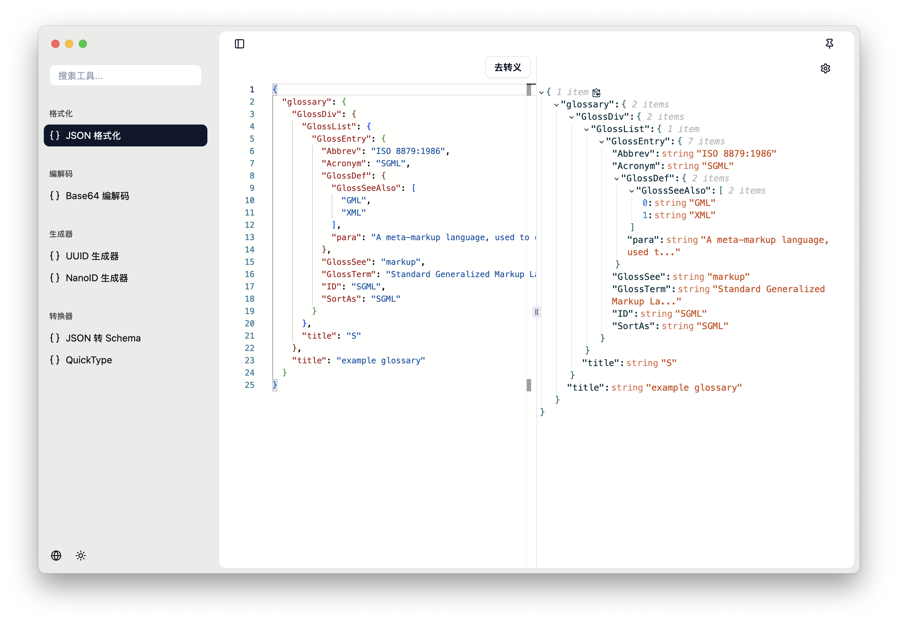
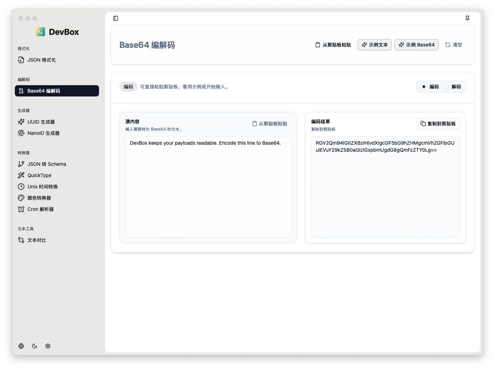
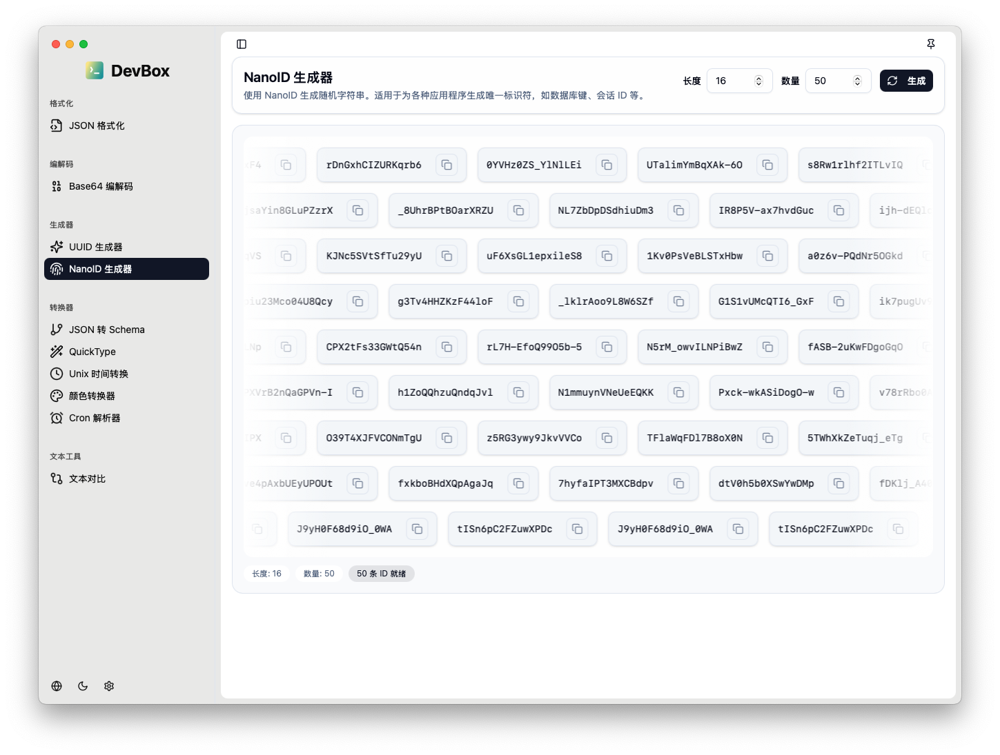
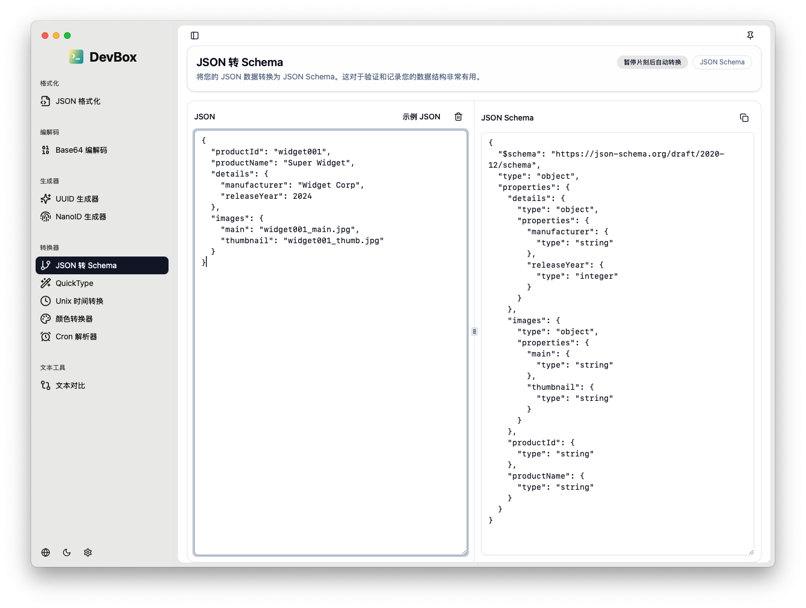
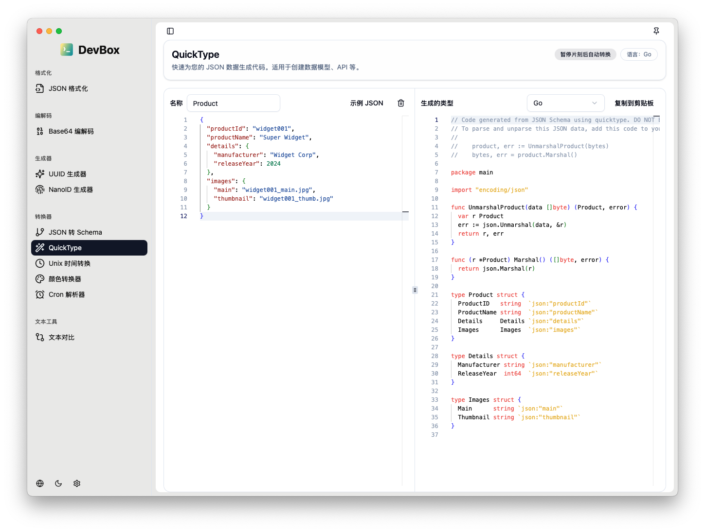
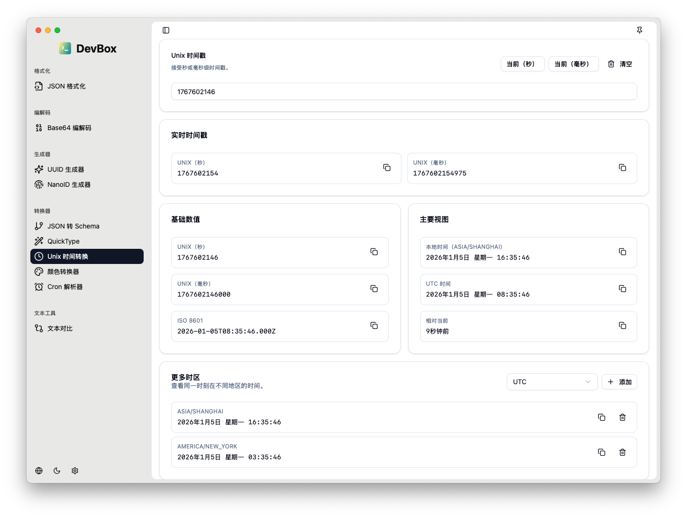
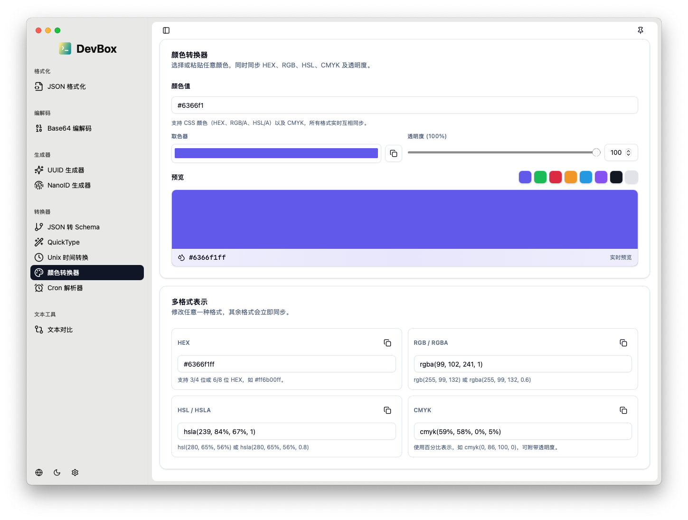
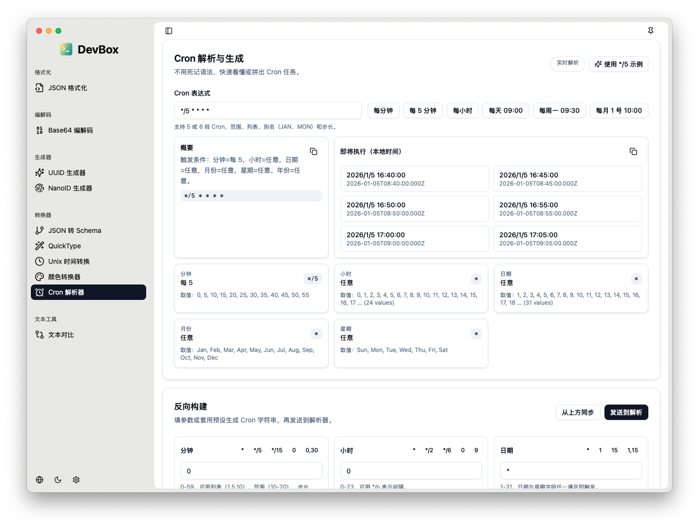
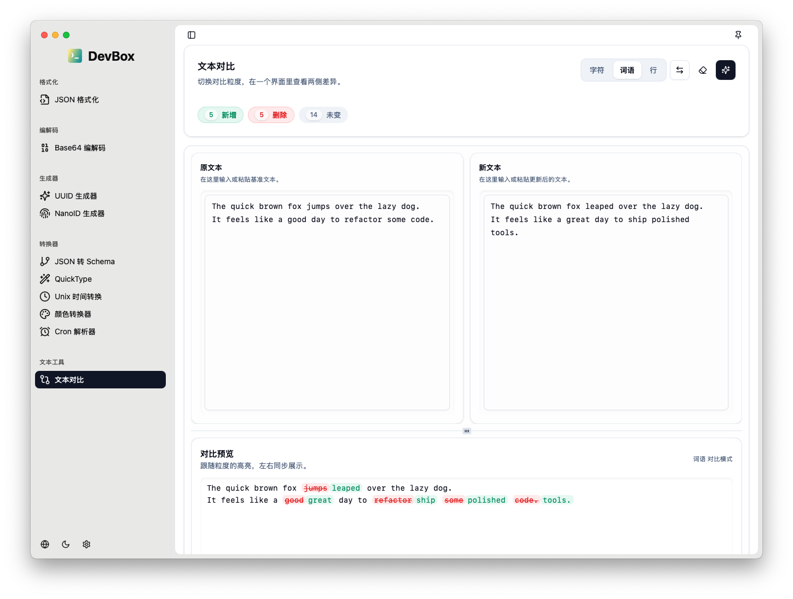

<h4 align="right">
  <strong>English</strong> | <a href="./README_CN.md">简体中文</a>
</h4>

    

<h1 align="center">DevBox</h1>

  <strong>⚡ Universal developer toolkit for software, hardware, and security professionals.</strong>

## 📦 Screenshots

**Home**

**JSON format**

**Base64 Codec**

**UUID Generator**

**Nanoid Generator**

**JSON to Schema**

Convert JSON data into JSON Schema for validation and documentation.

- Live conversion
- Pause-to-convert mode
- Schema validation support
- 💎 Pro feature

**QuickType**

Generate code types from JSON data for various programming languages.

- Support for multiple languages (JavaScript, TypeScript, Python, Go, etc.)
- Type definitions generation
- API model creation
- 💎 Pro feature

**Unix Timestamp Converter**

Convert Unix timestamps to human-readable dates and vice versa.

- Supports seconds and milliseconds
- Multiple timezone support
- ISO 8601 format
- ✅ Free tool

**Color Converter**

Convert between different color formats (HEX, RGB, HSL, CMYK).

- Live color preview
- Color picker integration
- Alpha channel support
- 💎 Pro feature

**Cron Parser**

Parse cron expressions and build schedules visually.

- Visual cron builder
- Preset schedules
- Next run times preview
- Expression validation
- 💎 Pro feature

**Text Diff**

Compare and visualize differences between two texts.

- Side-by-side comparison
- Multiple granularity modes (characters/words/lines)
- 💎 Pro feature

## Download and install

DevBox support macOS Silicon, macOS Intel, Linux and Windows.

Download from [GitHub Releases](https://github.com/carlos19960601/DevBox/releases).

